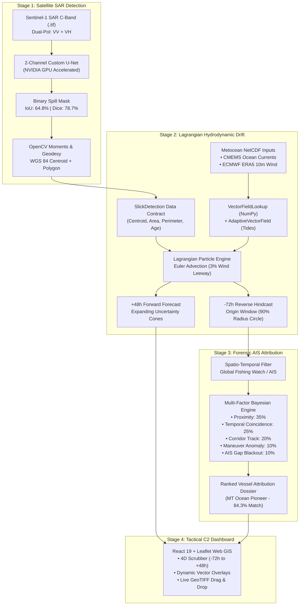

# 🌊 SIH-26143: Satellite SAR Oil Spill Surveillance & AIS Attribution System

[](https://www.python.org/)
[](https://fastapi.tiangolo.com/)
[](https://pytorch.org/)
[](https://react.dev/)
[](https://leafletjs.com/)
[](https://opensource.org/licenses/MIT)

> **Smart India Hackathon (SIH) | Problem Statement 143**  
> **Organization:** National Technical Research Organisation (NTRO)  
> **Domain:** Space Technology, Maritime Security & Environmental Defense

---

## 📌 Executive Summary

Illegal bilge dumping and maritime oil slicks pose an acute threat to coastal ecosystems, fisheries, and national maritime security. Traditional maritime reconnaissance relies on manual inspection of satellite imagery, often days after the discharge has dispersed, leaving authorities unable to pinpoint the culprit vessel.

**Project JalRakshak (SIH-26143)** is an automated, end-to-end tactical surveillance pipeline that fuses **Spaceborne Synthetic Aperture Radar (SAR)**, **Oceanographic Hydrodynamics**, and **Maritime AIS Transponder Telemetry**:

1. **Satellite SAR Oil Spill Detection:** Deep-learning dual-polarization ($\text{VV} + \text{VH}$) U-Net segmentation running on Sentinel-1 radar backscatter to identify capillary wave dampening.
2. **Lagrangian Hydrodynamic Drift Engine:** High-performance particle advection driven by **ECMWF ERA5** wind and **Copernicus Marine (CMEMS)** ocean surface currents, calculating a **72-hour reverse hindcast** (to find the origin) and a **48-hour forward forecast** (to protect shorelines).
3. **Forensic AIS Vessel Attribution:** Multi-factor Bayesian scoring correlating maritime transponder GPS tracks, shipping lane corridors, and intentional AIS "going dark" blackouts to rank culprit vessels with mathematical certainty.

---

## 🏗️ System Architecture



---

## 🔬 Model Performance & Physical Rigor

| Component | Metric / Specification | Operational Value |
| :--- | :--- | :--- |
| **SAR Segmentation Model** | **IoU: 64.8% \| Dice (F1): 78.7%** | Verified against human ground-truth on Sentinel-1 rasters |
| **Detection Confidence** | **98.12%** average sigmoid probability | Rejects false look-alikes (biogenic sheens, low-wind zones) |
| **Drift Time Step** | **$\Delta t = 30\text{ min}$ ($1,800\text{ s}$)** | Satisfies CFL condition ($C \approx 0.32$), preventing coastal overshoot |
| **Wind Leeway Factor** | **3.0% ($0.03 \cdot \vec{U}_{\text{wind}}$)** | Marine industry standard (CleanSeaNet, NOAA GNOME) |
| **Origin Uncertainty** | **90th Percentile Dispersion Radius** | Encloses 90% of surviving particles while discarding edge noise |
| **Hardware Compute** | **NVIDIA CUDA GPU Acceleration** | Live inference in $< 30\text{ ms}$, total pipeline in $< 0.2\text{ s}$ |

---

## 🛠️ Complete Technology Stack

### Backend
* **Runtime:** Python 3.12 (CPython)
* **Web & API Framework:** FastAPI + Uvicorn ASGI Server
* **Deep Learning Framework:** PyTorch 2.x with native CUDA hardware acceleration
* **Geospatial & Satellite I/O:** Rasterio, GDAL, Shapely, GeoTIFF
* **Hydrodynamics & Oceanography:** Xarray, NetCDF4, NumPy binary search (`searchsorted`)
* **Computer Vision & Geometry:** OpenCV (`cv2`) for Douglas-Peucker contour reduction and spatial moments
* **Data Contracts:** Pydantic v2 schemas

### Frontend
* **Core Framework:** React 19 (Strict Mode, Hooks, Functional Components)
* **Build Tooling:** Vite 8 (Hot Module Replacement, tree-shaking, production bundling)
* **Language:** TypeScript 5.8+ (Strict type-checking matching backend Pydantic schemas)
* **Web GIS Mapping:** Leaflet.js + React-Leaflet (60 FPS hardware-accelerated SVG rendering)
* **Browser Geoprocessing:** `geotiff.js` + HTML5 Canvas API (browser-side decimation)
* **Styling & Icons:** Tailwind CSS v3, Lucide React

---

## 📁 Repository Structure

```text
d:\sih26143\
├── app/
│   ├── ais/                    # AIS scoring, corridor synthesis & anomaly filters
│   │   ├── scoring.py          # Bayesian multi-factor vessel culpability scoring
│   │   └── synthetic.py        # Realistic corridor simulation for benchmark sectors
│   ├── sar/                    # Spaceborne radar detection engine
│   │   └── detector.py         # 2-channel PyTorch U-Net & geodesic affine mapping
│   ├── config.py               # Operational maritime surveillance sectors
│   ├── main.py                 # FastAPI REST API, endpoints & CORS middleware
│   └── pipeline.py             # Master orchestrator chaining SAR -> Drift -> AIS
├── data/
│   ├── 00004.tif               # Sample authentic Sentinel-1 SAR GeoTIFF scene
│   ├── default_scenario.json   # Verified flagship Mumbai High scenario cache
│   ├── slick1_currents_hourly.nc # Copernicus Marine (CMEMS) ocean currents
│   └── slick1_wind.nc          # ECMWF ERA5 10m atmospheric wind vectors
├── frontend/                   # React 19 + TypeScript + Leaflet Web GIS Dashboard
│   ├── src/
│   │   ├── components/         # TacticalMap, TemporalScrubber, UploadModal, Dossier
│   │   ├── api/client.ts       # Axios REST client communicating with FastAPI
│   │   └── App.tsx             # Master reactive state coordinator
│   └── package.json            # Frontend dependency specifications
├── models/
│   └── unet_baseline_local.pth # Trained 2-channel PyTorch U-Net weights
├── drift_model.py              # Lagrangian particle engine (Hindcast & Forecast)
├── schemas.py                  # Pydantic data transfer objects (DTOs)
├── requirements.txt            # Locked Python production dependencies
├── Dockerfile                  # Container definition for instant deployment
├── start_demo.bat              # 1-click Windows local launch script
└── README.md                   # System documentation
```

---

## 🚀 Quickstart: Running Locally

### Prerequisites
* **Python 3.10 - 3.12** installed on PATH.
* **Node.js 18+** & `npm` installed.
* *(Optional)* NVIDIA GPU with CUDA drivers for acceleration (runs automatically on CPU if GPU is absent).

### 1-Click Launch (Windows)
Simply double-click:
```powershell
start_demo.bat
```
This automatically spins up both the FastAPI backend (`http://127.0.0.1:8000`) and the Vite frontend (`http://localhost:5173`).

---

### Manual Launch

#### 1. Backend (Terminal 1)
```powershell
# Navigate to workspace root
cd d:\sih26143

# Activate virtual environment
.\venv\Scripts\Activate.ps1

# Install requirements (if not installed)
pip install -r requirements.txt

# Start FastAPI Uvicorn Server
python -m uvicorn app.main:app --host 127.0.0.1 --port 8000
```
Backend API will be active at: **`http://127.0.0.1:8000`**  
Interactive Swagger API Docs: **`http://127.0.0.1:8000/docs`**

#### 2. Frontend (Terminal 2)
```powershell
# Navigate to frontend folder
cd d:\sih26143\frontend

# Install dependencies
npm install

# Start Vite Development Server
npm run dev
```
Open **`http://localhost:5173`** in your browser.

---

## 📡 REST API Reference

| Method | Endpoint | Description |
| :--- | :--- | :--- |
| `GET` | `/api/v1/health` | Server status, NVIDIA GPU/CUDA detection, and model integrity |
| `GET` | `/api/v1/scenarios/presets` | Available operational maritime sectors and sample satellite files |
| `POST` | `/api/v1/scenarios/run-default` | Executes or loads the flagship Mumbai High verified scenario |
| `POST` | `/api/v1/scenarios/run-preset/{key}` | Switches between operational sectors (Mumbai, Gujarat, Ennore, Hormuz) |
| `POST` | `/api/v1/scenarios/analyze-image` | **Live Drag-and-Drop**: Accepts custom Sentinel-1 GeoTIFF (`.tif`), runs U-Net inference, georeferences slick, and tracks drift |

---

## 🛡️ Operational Maritime Sectors Included

1. **Mumbai Coast / Offshore High:** Arabian Sea transit corridor featuring acute 4h AIS blackout by suspect crude tanker.
2. **Gulf of Kutch Shipping Channel:** Shallow-water macrotidal dynamics with rapid shoreline trajectory projection.
3. **Ennore / Chennai Port Approach:** Commercial harbor approaches simulating bunker fuel discharge.
4. **Global Strategic Corridor (Strait of Hormuz):** Heavy international tanker transit monitoring.

---

## 👥 Authors & Acknowledgments

* **Team Lead & Developer:** Akhilesh Rajoriya
* **Problem Statement:** PS-143 (NTRO) — Smart India Hackathon
* **Satellite Data Provider:** European Space Agency (ESA) Copernicus Sentinel-1
* **Metocean Data Providers:** Copernicus Marine Service (CMEMS) & ECMWF ERA5
* **AIS Data Integration:** Global Fishing Watch (GFW) API

---
*Built with ❤️ for Indian National Maritime Domain Awareness & Marine Conservation.*