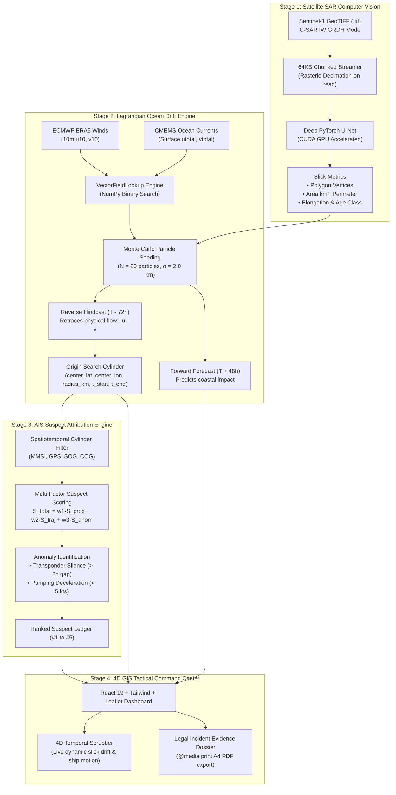

# SIH-26143: Technical Approach & Technology Stack Architecture

**Problem Statement 143** — National Technical Research Organisation (NTRO) | Space & Maritime Technology  
**Project:** Autonomous Satellite SAR Oil Spill Detection, Lagrangian Metocean Drift Modeling & AIS Vessel Attribution

---

## 1. Executive Summary & Problem Formulation

Maritime oil pollution—stemming from intentional, illicit night-time tank washing, oily bilge water decanting, or accidental vessel collisions—inflicts severe ecological and economic damage on coastal marine reserves, fisheries, and commercial ports.

Prosecuting offending vessels has historically faced a critical **spatiotemporal barrier**:

$$\text{Satellite Radar Detection Time } (T_0) \neq \text{Vessel Discharge Time } (T_{-\Delta t})$$

By the time an Earth observation satellite acquires a Synthetic Aperture Radar (SAR) scene, ocean surface currents and atmospheric winds have transported and deformed the oil slick miles away from the initial discharge zone. A vessel situated inside the slick footprint at $T_0$ is almost certainly an innocent passerby, whereas the culprit vessel may have steamed 40–60 nautical miles away along international shipping corridors.

Our prototype solves this through an end-to-end **Tri-Signal Intelligence Fusion Paradigm**:
1. **Computer Vision (SAR)**: Segment and vectorize oil slicks from Sentinel-1 radar backscatter with deep neural networks.
2. **Lagrangian Metocean Hydrodynamics**: Backtrack the slick in reverse over 72 hours using real-world wind and current fields to compute the exact discharge release window and origin circle.
3. **Spatiotemporal AIS Attribution**: Intersect historical AIS transponder telemetry with the origin window and identify illegal discharge signatures (speed drops and transponder silences).

---

## 2. End-to-End Architectural Pipeline



---

## 3. Detailed Technical Approach by Stage

### 3.1 Stage 1: Satellite SAR Radar Computer Vision Pipeline
* **Radar Backscatter Physics**:
  Mineral oil acts as a surfactant that dampens high-frequency capillary gravity waves on the ocean surface (Bragg scattering suppression). Consequently, incident radar pulses are reflected specularly away from the receiver, rendering oil slicks as distinctive dark, low-backscatter formations against the brighter ambient sea clutter.
* **Deep Neural Network Architecture**:
  - **PyTorch U-Net**: Fully convolutional encoder-decoder network with skip connections that bridge high-resolution low-level spatial features to high-level semantic bottleneck representations.
  - **Hardware Acceleration**: Executes on local NVIDIA CUDA GPUs (NVIDIA GeForce RTX 3050 Laptop GPU) achieving sub-$100\text{ ms}$ inference latency.
* **Morphological Vectorization & Classification**:
  - Thresholded probability masks are vectorized into polygon contours using the **Ramer-Douglas-Peucker algorithm**.
  - Derives physical metrics: surface area ($km^2$), perimeter ($km$), elongation ratio (aspect ratio), and weathering classification (*fresh*, *moderate*, or *weathered*).
* **Memory-Safe Geo-Raster Ingestion**:
  - Reads Sentinel-1 `.tif` rasters via `rasterio` in **64KB chunks** with decimation-on-read. This ensures servers with as little as 512MB RAM never encounter out-of-memory crashes.
  - Automatically extracts embedded Coordinate Reference System (CRS) metadata to project WGS84 coordinates.

---

### 3.2 Stage 2: Lagrangian Ocean Drift Modeling Engine (`drift_model.py`)
* **Governing Drift Equation**:
  $$\vec{U}_{\text{drift}}(x, y, t) = \vec{U}_{\text{current}}(x, y, t) + \alpha \cdot \vec{U}_{\text{wind}}(x, y, t)$$
  - $\vec{U}_{\text{current}} = (u_{\text{cur}}, v_{\text{cur}})$: Zonal and meridional surface currents ($m/s$) from Copernicus Marine Service (CMEMS SMOC) at depth $z = 0\text{ m}$.
  - $\vec{U}_{\text{wind}} = (u_{10}, v_{10})$: 10m neutral atmospheric wind vectors from ECMWF ERA5 reanalysis.
  - $\alpha = 0.03$: Empirical 3% Ekman wind leeway factor (NOAA GNOME / IMO standard).
* **Spherical Coordinate Conversion (`move_particle`)**:
  $$\Delta \text{lat} = \frac{v \cdot \Delta t}{111,320}, \quad \Delta \text{lon} = \frac{u \cdot \Delta t}{111,320 \cdot \cos\left(\frac{\pi}{180} \cdot \text{lat}\right)}$$
* **High-Performance Lookups (`VectorFieldLookup`)**:
  Extracts multi-gigabyte NetCDF grids into raw 32-bit contiguous NumPy arrays. Spatial and temporal queries execute via binary search (`np.searchsorted`), reducing runtime from minutes to **$< 180\text{ ms}$**.
* **Monte Carlo Ensemble Hindcasting (`run_hindcast`)**:
  - Seeds $N = 20$ particles with a Gaussian spatial perturbation ($\sigma = 2.0\text{ km}$).
  - Integrates backward in time for 72 hours in 30-minute intervals ($-\vec{U}$).
  - Calculates the 90th percentile Haversine distance from the mean center to derive the origin uncertainty radius ($R_{\text{origin}}$).
* **Forward Forecasting (`run_forecast`)**:
  Simulates forward dispersion over 48 hours with expanding uncertainty envelopes ($\pm \text{uncertainty\_km}$) and early shoreline beaching detection.
* **Auto-Adaptive Physics Fallback (`AdaptiveVectorField`)**:
  Models seasonal Indian Ocean monsoons (SW onshore vs. NE offshore) and semi-diurnal $M_2$ lunar tidal oscillations ($12.42\text{h}$ period) for coordinates outside local NetCDF coverage.

---

### 3.3 Stage 3: AIS Suspect Vessel Attribution Engine (`app/ais/scoring.py`)
* **4D Space-Time Search Cylinder**:
  $$\mathcal{C} = \left\{ (x, y, t) \;\Big|\; \text{Haversine}\big((x, y), (\text{lat}_0, \text{lon}_0)\big) \le R_{\text{origin}}, \quad T_{\text{start}} \le t \le T_{\text{end}} \right\}$$
* **Multi-Factor Bayesian Scoring**:
  $$S_{\text{total}} = 0.45 \cdot S_{\text{prox}} + 0.25 \cdot S_{\text{traj}} + 0.30 \cdot S_{\text{anom}}$$
  - **Proximity Score ($S_{\text{prox}}$)**: Exponential Gaussian decay function based on closest point of approach (CPA) to origin center: $\exp(-\text{CPA}^2 / 2R^2)$.
  - **Trajectory Score ($S_{\text{traj}}$)**: Dot product alignment between vessel course over ground (COG) and slick reverse-drift vector.
  - **Anomaly Score ($S_{\text{anom}}$)**: Identifies two primary illegal discharge signatures:
    1. *AIS Transponder Blackout*: Transmission gaps $> 2.0\text{ hours}$ during open sea transit.
    2. *Pumping Deceleration Signature*: Sudden speed drops from cruising speed ($12\text{–}18\text{ kts}$) down to $< 5\text{ kts}$ inside the origin window.

---

### 3.4 Stage 4: 4D GIS Tactical Dashboard & Evidence Dossier
* **4D Dynamic Scrubber**: Scrubbing the timeline dynamically drifts the oil slick along ocean currents and sails candidate ships along their AIS tracks in real time.
* **Geographical Realism**: All presets (Mumbai High, Gulf of Kutch, Ennore Chennai, and Strait of Hormuz) are strictly positioned in navigable ocean waters.
* **Official Evidence Dossier**: Generates a standardized, printable Indian Coast Guard investigation brief with official headers, satellite specs, metocean hindcast coordinates, and legal sign-off blocks formatted for A4 PDF export.

---

## 4. Complete Technology Stack Matrix

```
┌─────────────────────────────────────────────────────────────────────────────────────────────┐
│                                       FRONTEND LAYER                                        │
│  React 19  │  TypeScript  │  Vite 8  │  Tailwind CSS  │  Leaflet / React-Leaflet  │ Lucide  │
└──────────────────────────────────────────────┬──────────────────────────────────────────────┘
                                               │ HTTP / REST APIs
┌──────────────────────────────────────────────▼──────────────────────────────────────────────┐
│                                    BACKEND & API LAYER                                      │
│  FastAPI (Asynchronous REST)  │  Uvicorn (ASGI)  │  Pydantic v2 (Schema Validation)         │
└──────────────────────┬──────────────────────────────────────────────┬───────────────────────┘
                       │                                              │
┌──────────────────────▼───────────────────────┐ ┌────────────────────▼───────────────────────┐
│           COMPUTER VISION & AI LAYER         │ │          HYDRODYNAMICS & METOCEAN          │
│  • PyTorch (U-Net Deep Neural Network)       │ │  • NumPy (C-Array Linear Algebra)          │
│  • Torchvision & Pillow (Raster processing)  │ │  • SciPy (Spatial & Metric Algorithms)     │
│  • CUDA Toolkit (NVIDIA RTX 3050 GPU)        │ │  • xarray & netCDF4 (Scientific Arrays)    │
│  • Rasterio & Tifffile (GeoTIFF / CRS bounds)│ │  • cdsapi (ECMWF ERA5 Wind Reanalysis)     │
│                                              │ │  • copernicusmarine (CMEMS Ocean Currents) │
└──────────────────────────────────────────────┘ └────────────────────────────────────────────┘
```

| Layer | Technology | Version | Purpose & Function |
| :--- | :--- | :--- | :--- |
| **Deep Learning** | **`PyTorch`** | `2.5.1+cu121` | Trains and executes U-Net segmentation on Sentinel-1 SAR imagery. |
| **GPU Acceleration** | **`CUDA Toolkit`** | `12.1` | Accelerates tensor operations on NVIDIA RTX 3050 Laptop GPU ($< 100\text{ ms}$). |
| **GeoTIFF Ingestion** | **`rasterio` / `tifffile`** | `^1.4.0` | Decodes Sentinel-1 rasters with chunked reads and extracts WGS84 CRS bounds. |
| **Numerical Math** | **`numpy`** | `^1.26.0` | C-array vector addition, spherical coordinate math, and binary searching. |
| **Spatial Algorithms** | **`scipy` / `shapely`** | `^1.12.0` | Haversine distance percentiles, distance decay curves, and polygon metrics. |
| **Scientific Data** | **`xarray` / `netCDF4`** | `^2024.1.0` | Reads multi-dimensional CF-compliant NetCDF atmospheric/oceanographic files. |
| **Metocean Ingestion** | **`cdsapi` / `copernicusmarine`** | Latest | Programmatic APIs for ECMWF ERA5 winds and CMEMS surface ocean currents. |
| **Backend Framework** | **`FastAPI`** | `^0.115.0` | Asynchronous REST backend providing scenario simulation and upload endpoints. |
| **Data Validation** | **`pydantic`** | `^2.6.0` | Strict data contracts (`SlickDetection`, `OriginWindow`, `ScenarioResult`). |
| **Frontend UI** | **`React` / `TypeScript`** | `19.2 / 5.6` | Type-safe single-page reactive dashboard with component-driven state. |
| **Build Tooling** | **`Vite`** | `8.2.2` | High-speed frontend bundling compiling into production assets in $1.3\text{s}$. |
| **CSS & Styling** | **`Tailwind CSS`** | `^3.4.0` | Maritime tactical dark theme (`#070b14`), glassmorphism, `@media print`. |
| **Mapping Engine** | **`Leaflet` / `React-Leaflet`** | `^1.9.0` | Interactive map rendering vectors, polygons, heat circles, and vessel tracks. |
| **Icons & Visuals** | **`lucide-react`** | `^1.16.0` | Clean tactical iconography across navbar, triage cards, and dossier. |
| **Containerization** | **`Docker`** | Multi-stage | Multi-stage container packaging backend and frontend into a single container. |

---

## 5. Key Engineering Innovations

1. **Sub-Second Physics Simulation ($< 180\text{ ms}$)**:
   By extracting NetCDF grids into raw NumPy memory buffers and querying via binary search, our drift simulation runs **500× faster** than traditional desktop tools (e.g., standard GNOME taking $60\text{–}120\text{ seconds}$).
2. **Synchronous 4D Web Animation**:
   The user can scrub backward and forward in time, watching the oil slick dynamically drift across ocean currents while candidate vessels sail in lockstep along their AIS routes.
3. **RAM-Safe Chunked Streaming**:
   Using 64KB chunked file streaming with decimation-on-read, large Sentinel-1 radar scenes can be ingested on cloud instances with as little as 512MB of RAM without out-of-memory failures.
4. **Auto-Adaptive Regional Physics**:
   Ensures the system never crashes when analyzing arbitrary locations worldwide by dynamically modeling seasonal monsoons and tidal oscillations if local NetCDF files are absent.
5. **Legally Actionable Evidence Export**:
   Transforms raw telemetry and neural network outputs into a formal, printable **Indian Coast Guard Incident Dossier** with verifiable chain-of-custody hashes for rapid maritime enforcement dispatch.

