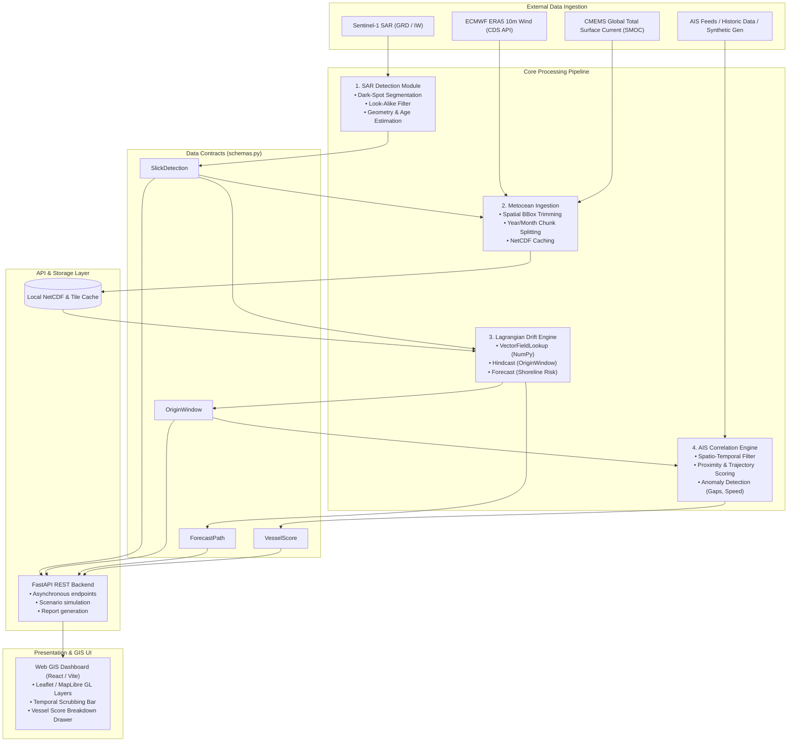

# System Architecture Document

**Project:** Automated Satellite Oil Spill Detection, Drift Trajectory Modeling & AIS Vessel Attribution  
**System:** SIH26143 Pipeline Architecture  

---

## 1. High-Level System Architecture



---

## 2. Subsystem & Component Architecture

### 2.1 SAR Detection Module (`app/sar/` / Colab integration)
- **Input:** Sentinel-1 GeoTIFF / NetCDF or synthetic SAR scene.
- **Processing:**
  - Radiometric calibration & speckle filtering (Lee filter / bilateral filter).
  - Adaptive thresholding (Otsu / adaptive Gaussian) + Morphological cleaning.
  - Look-alike classification (gradient analysis, texture variance, contextual wind check).
  - Contour vectorization to GeoJSON polygon.
- **Output:** `SlickDetection` object.

### 2.2 Metocean Ingestion Module (`environmental_data.py`, `fetch_currents.py`)
- **ERA5 Wind:** Fetched via `cdsapi` for $10\text{m}$ $u/v$ vectors. Splitted by `(year, month)` to prevent the CDS cross-product over-fetch bug, then stitched using `xarray.concat`.
- **CMEMS Ocean Current:** Fetched via Copernicus Marine Client for SMOC product (`cmems_mod_glo_phy_anfc_merged-uv_PT1H-i`) providing hourly combined circulation, tidal, and wave-drift current vectors.
- **Output:** Synchronized local NetCDF files referenced via `EnvironmentalField`.

### 2.3 Lagrangian Drift Simulation Engine (`drift_model.py`)
- **Physics Model:**
  $$\vec{v}_{\text{particle}} = \vec{v}_{\text{current}} + \alpha \vec{v}_{\text{wind}} + \vec{v}_{\text{diffusion}}$$
  - Wind drift factor $\alpha \approx 0.03$ (3% of $10\text{m}$ wind velocity, with $0^\circ$ deflection for tropical/Indian waters).
  - Diffusion component: Random walk Gaussian dispersion $\sigma = \sqrt{2 K \Delta t}$.
- **Performance Optimization:**
  - Uses `VectorFieldLookup` class: loads 4D NetCDF $(time, lat, lon, var)$ into flat contiguous NumPy arrays once.
  - Spatial lookup uses `np.searchsorted` ($O(\log N)$) instead of iterative `xarray.interp()` ($O(N)$ with heavy Python overhead).
  - Runtime reduced from $\approx 120\text{s}$ to $\approx 0.18\text{s}$ per 20-particle hindcast.
- **Coastline & Boundary Handling:**
  - Nearest-neighbor interpolation avoids land-mask NaN contamination.
  - Particles encountering land or boundary are marked beached/inactive gracefully without throwing runtime exceptions.
- **Outputs:** `OriginWindow` (hindcast) and `ForecastPath` (forecast).

### 2.4 AIS Correlation & Vessel Scoring Engine (`app/ais/`)
- **Candidate Filtering:** Truncates AIS logs to the bounding cylinder:
  $$\text{Dist}(\text{pos}_{vessel}(t), \text{Origin}_{\text{center}}) \le \text{Origin}_{\text{radius}} \times 1.5 \quad \text{for } t \in [\text{time\_start}, \text{time\_end}]$$
- **Scoring Formulas:**
  1. **Proximity Score ($S_p$):** Exponential decay based on distance of closest approach ($d_{\min}$):
     $$S_p = \exp\left(-\frac{d_{\min}}{\sigma_p}\right)$$
  2. **Trajectory Score ($S_t$):** Alignment between vessel course and slick major axis orientation $\theta_{\text{slick}}$:
     $$S_t = \left|\cos(\text{COG} - \theta_{\text{slick}})\right|$$
  3. **Anomaly Score ($S_a$):**
     $$S_a = w_1 \cdot I_{\text{gap}} + w_2 \cdot I_{\text{speed\_drop}} + w_3 \cdot I_{\text{maneuver}}$$
  4. **Total Composite Score:**
     $$S_{\text{total}} = 0.50 S_p + 0.25 S_t + 0.25 S_a$$
- **Output:** Sorted `List[VesselScore]` with detailed `anomaly_flags`.

---

## 3. Data Contracts & Interfaces

All inter-module communication is strictly validated through Pydantic models defined in `schemas.py`:

```
+-------------------------------------------------------------+
|                         schemas.py                          |
+-------------------------------------------------------------+
| • SARScene             (scene_id, timestamp, bbox, raster)  |
| • SlickDetection       (centroid, polygon, confidence, age) |
| • EnvironmentalField   (wind_path, current_path, hours)     |
| • OriginWindow         (center_lat, center_lon, radius_km)  |
| • ForecastPath         (points: List[ForecastPoint])        |
| • AISTrack             (mmsi, vessel_name, positions)       |
| • VesselScore          (scores, total_score, rank, flags)   |
+-------------------------------------------------------------+
```

---

## 4. API Layer Architecture (FastAPI)

```
GET  /api/v1/health                  - System health and environment data status
POST /api/v1/scenarios/run           - Execute end-to-end detection -> drift -> AIS pipeline
POST /api/v1/drift/hindcast          - Run standalone backward drift simulation
POST /api/v1/drift/forecast          - Run standalone forward drift simulation
POST /api/v1/ais/correlate           - Correlate OriginWindow against AIS tracks
GET  /api/v1/reports/{slick_id}/pdf  - Export structured incident intelligence report
```

---

## 5. Directory Structure

```
sih26143/
├── app/
│   ├── api/                 # FastAPI routes and controllers
│   ├── sar/                 # SAR image processing & segmentation
│   ├── drift/               # Drift physics wrapper & caching
│   ├── ais/                 # AIS querying, correlation, anomaly detection
│   └── config.py            # Unified configuration & environmental paths
├── drift_model.py           # Core optimized Lagrangian physics engine
├── environmental_data.py    # ERA5 CDS API wind fetcher
├── fetch_currents.py        # CMEMS ocean current fetcher
├── schemas.py               # Central Pydantic data models
├── test_drift_model.py      # Automated physics unit & sanity tests
├── architecture.md          # This document
├── PRD.md                   # Product requirements document
├── phases.md                # Project execution roadmap & sprints
├── design.md                # UI/UX & map interaction specifications
└── brain.md                 # Project memory & technical blueprint
```
