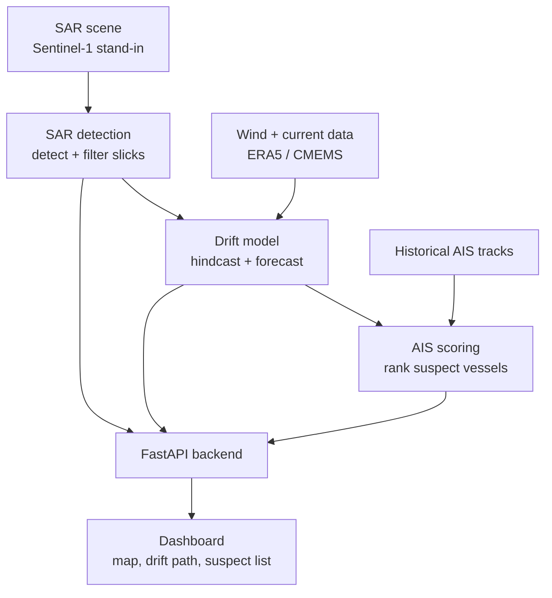

# brain.md — SIH26143 Project Blueprint & Memory

**Problem Statement 143** — Leveraging satellite imagery to determine oil spills at sea along with AIS data correlations to identify the vessel responsible for the spill.
**Sponsor:** NTRO | **Category:** Software, Space Technology
**Status as of this document:** Environmental-data + drift-model pipeline complete and tested. SAR detection and AIS scoring in progress by teammates (not yet merged into this repo).

This file is project memory, not a proposal. It reflects what actually exists in the repository today, what decisions were made and why, and what remains. Update it whenever a module's status changes — it is the single place a teammate (or you, in two weeks) can read to understand the *current real state* of the project without re-deriving decisions from chat history.

---

## 1. Project mission

Marine oil spills damage ecosystems and routinely go unattributed because no operational, automated, India-relevant pipeline exists connecting three separate signals: what the spill looks like from space, where it physically came from, and which vessel was in a position to cause it.

**Intended users:** NTRO and coastal enforcement/maritime surveillance agencies (primary); Coast Guard, pollution-control boards, port authorities (secondary).

**Why vessel attribution must be a probability ranking, not an accusation:** every input in this pipeline carries real uncertainty — SAR detection has false-positive risk (look-alikes), drift simulation accumulates positional error over time, and AIS coverage has gaps and possible spoofing. Presenting a single named "guilty vessel" would misrepresent what the system can actually support. Instead, the system outputs a **ranked, scored list of candidate vessels with explicit sub-scores and confidence**, so a human investigator uses it as a lead-generation and evidence tool, not a verdict. This is a design commitment, not a legal disclaimer bolted on afterward — it shapes the output schema (`VesselScore` carries sub-scores, not just a rank) and the dashboard (uncertainty is always shown alongside estimates).

---

## 2. Existing codebase assessment

*(Based on direct inspection of the repository as built through this project's development sessions. Teammates' SAR/AIS work lives in Google Colab notebooks + Google Drive and has not yet been merged into this repo — see Section 16 for the action this requires.)*

### 2.1 Files that exist today, and their real role

| File | Role | Status |
|---|---|---|
| `schemas.py` | Shared Pydantic data contracts for the whole pipeline: `SARScene`, `SlickDetection`, `AgeClass`, `EnvironmentalField`, `OriginWindow`, `ForecastPoint`, `ForecastPath`, `AISPosition`, `AISTrack`, `VesselScore` | **Working, but not yet team-reviewed.** Drafted and proposed to the team; drift model already builds against it successfully. SAR/AIS modules have not yet been confirmed to match these shapes. |
| `environmental_data.py` | `fetch_era5_wind(slick, out_path, radius_deg, hours_before, hours_after)` — pulls real ERA5 10m u/v wind via `cdsapi`, parameterised by any `SlickDetection`. Splits requests by (year, month) and merges via `xarray.concat`, then trims to the exact window, to avoid CDS's year/month/day cross-product over-fetch bug. | **Working, tested.** Validated against a real Mumbai-coast scenario; confirmed correct time/space coverage after the month-splitting fix. |
| `fetch_currents.py` | `fetch_ocean_currents(slick, out_path, radius_deg, hours_before, hours_after)` — pulls real hourly total surface current (`utotal`, `vtotal`: circulation + tide + wave-drift) from CMEMS dataset `cmems_mod_glo_phy_anfc_merged-uv_PT1H-i` (the SMOC product, CMEMS's own recommendation for Lagrangian drift work). | **Working, tested.** Confirmed correct hourly cadence and spatial coverage matching the wind data. |
| `drift_model.py` | Core physics: `VectorFieldLookup` (pre-loads wind/current NetCDF into plain NumPy arrays once, does fast nearest-neighbor lookups via `np.searchsorted` instead of repeated `xarray.interp()` calls), `move_particle`, `haversine_km`, `run_hindcast` (20-particle ensemble, backward integration, returns `OriginWindow` with a real computed radius from particle spread), `run_forecast` (10-particle ensemble, forward integration, returns `ForecastPath` with per-point growing `uncertainty_km`, stops cleanly if the majority of particles reach shore or leave data coverage). | **Working, tested, optimized.** Went from ~2 min to ~0.18s per hindcast after replacing repeated `xarray.interp()` with pre-loaded NumPy arrays. Handles the real coastline-NaN problem (nearest-neighbor instead of linear interpolation avoids blending with land cells) and the real "particle beaches" case (graceful early stop, not a crash). |
| `test_drift_model.py` | Automated sanity checks: confidence in [0,1], origin within a plausible distance of detection point, radius > 0, time ordering valid, forecast starts at the exact detection point with zero uncertainty, forecast timestamps strictly increasing. | **Working.** All checks currently pass. Run this after any change to `drift_model.py` before trusting new output. |
| `test_era5.py`, `inspect_era5.py`, `inspect_currents.py` | One-off exploratory scripts used to validate the CDS/CMEMS connection and inspect downloaded NetCDF structure during setup. | **Not part of the pipeline.** Safe to keep for debugging reference, but not imported by anything else. Candidate for moving into a `scripts/` or `notebooks/` folder (see Section 12). |
| `app/config.py` | Defines `RegionOfInterest` (used by `synthetic_data.py`). | **Minimal, working**, but its relationship to the real `schemas.py` bounding-box logic (`compute_bbox` in `environmental_data.py`) has not been reconciled — two separate ways of representing "an area" currently exist in the repo. |
| `app/synthetic_data.py` | `generate_sar_scene(roi, seed, grid_size)` — generates a synthetic SAR background (Gaussian noise raster) for early testing. Currently only produces a flat noise background ("Stage 1"), with no slick, no look-alikes, no polygon extraction yet. | **Early-stage placeholder.** Useful for testing pipeline plumbing before real SAR detection exists, but does not yet represent a spill and should not be mistaken for the real SAR detection module. |
| `stage1_background.png` | Output image of the current `synthetic_data.py` run. | Artifact only, not code. |
| `.gitignore` | Excludes `venv/`, `__pycache__/`, `*.pyc`, `*.nc`, `.copernicusmarine/` | Working correctly, verified via `git status` during setup. |

### 2.2 What is genuinely missing or disconnected

- **SAR detection module** (FR-1 to FR-4: dark-spot detection, look-alike filtering, geometry, age classification) does not exist in this repo yet. Teammates are building it in Colab against real Sentinel-1 data and a synthetic AIS generator, separately.
- **AIS scoring module** (candidate filtering, proximity/trajectory/anomaly scoring) does not exist yet.
- **FastAPI backend** does not exist yet — nothing currently wires `drift_model.py`'s functions into an HTTP-callable service.
- **Dashboard** does not exist yet.
- **No shared merge point.** SAR/AIS work currently lives in Colab notebooks in Google Drive, not in this Git repository. Notebooks are not directly importable as Python modules — this is the single biggest structural risk to integration (see Section 16, task 1).
- **`RegionOfInterest` (app/config.py) vs. `compute_bbox()` (environmental_data.py)** — two independent representations of "a geographic area of interest" exist with no shared definition. Should be unified, ideally by extending `schemas.py`.

### 2.3 How each existing file fits into the final pipeline

```
SlickDetection (from SAR, not yet built)
      │
      ▼
environmental_data.py / fetch_currents.py  ──►  local .nc files
      │
      ▼
drift_model.py (VectorFieldLookup + run_hindcast + run_forecast)
      │
      ├──► OriginWindow  ──► (future) AIS scoring module
      └──► ForecastPath  ──► (future) dashboard
```

### 2.4 Exact next changes recommended for this repository right now

1. Reconcile `app/config.py`'s `RegionOfInterest` with `schemas.py` — pick one, don't maintain two.
2. Move `test_era5.py`, `inspect_era5.py`, `inspect_currents.py` into a `scripts/` folder so the repo root stays focused on the pipeline itself.
3. Get `schemas.py` reviewed and confirmed by whoever is building SAR and AIS modules, ideally against real sample outputs from their notebooks, not just in the abstract.
4. Establish the actual merge path from Colab notebooks into this repo (see Section 16).

---

## 3. End-to-end pipeline



**Observed data:** the SAR scene itself, raw AIS position reports, raw ERA5/CMEMS grids — measured, not derived.
**Computed outputs:** `SlickDetection` geometry (area, perimeter, elongation — computed from the detected polygon), bounding boxes and time windows (computed from a slick's centroid/timestamp).
**Model predictions:** `OriginWindow` and `ForecastPath` — the outputs of the Lagrangian particle simulation, genuinely predictive, not directly observed. `VesselScore` — a prediction about *likely* responsibility, not a fact.
**Uncertainty/confidence:** `OriginWindow.radius_km` and `.confidence` (from ensemble particle spread), `ForecastPoint.uncertainty_km` (grows over forecast time), `SlickDetection.oil_likelihood_confidence` (from SAR look-alike filtering, not yet built), `VesselScore` sub-scores (not yet built). Every prediction in this pipeline is required to carry an explicit uncertainty value — this is a hard design rule, not optional polish (ties to NFR-2 in the original PRD and to Section 1's ethics stance above).

---

## 4. SAR oil-spill detection module (MVP design — not yet implemented)

This module does not exist in the repo yet; this is the recommended design for whoever builds it.

**Pipeline stages:**
1. **Image loading + preprocessing** — load Sentinel-1 GRD (or synthetic stand-in, see `app/synthetic_data.py` as a Stage 1 starting point), apply speckle filtering (e.g. Lee or median filter) to reduce SAR speckle noise before detection.
2. **Backscatter normalization** — convert raw digital numbers to calibrated sigma-naught (dB), so thresholds are physically meaningful and comparable across scenes.
3. **Candidate dark-spot detection** — classical approach for MVP: adaptive thresholding (oil dampens capillary waves, appearing as a dark region relative to local background) rather than a global threshold, since background brightness varies across a scene.
4. **False-positive removal (look-alike filtering)** — cross-reference candidate regions against low-wind zones (oil-like dampening can also occur naturally in near-zero wind), shape heuristics (natural slicks are often more irregular; biogenic slicks tend to be thinner/more filamentous), and any available EO/optical band for corroboration if present.
5. **Segmentation/mask generation** — binary mask of confirmed candidate regions after filtering.
6. **Mask → geographic polygons** — convert pixel-space mask contours to lat/lon polygons using the scene's geotransform, matching the `polygon: List[List[float]]` field already defined in `schemas.py`'s `SlickDetection`.

**Required output fields (already defined in `schemas.py`, build against these exactly):**
`slick_id`, `timestamp`, `centroid_lat`/`centroid_lon`, `polygon`, `area_km2`, `perimeter_km`, `elongation_ratio`, `oil_likelihood_confidence`, `age_class`. Add `source_scene_id` (traceable back to the originating `SARScene`) if not already present.

**ML upgrade path (future, not MVP):** U-Net or DeepLab semantic segmentation, trained on labelled SAR oil-spill datasets, would replace step 3-5 with a learned segmentation mask. Prioritize the rule-based baseline first — it's explainable, requires no training data or GPU, and is demonstrably correct against a known case, which matters more for a 14-day prototype than marginal accuracy gains from an under-trained model.

---

## 5. Spill geometry and age

- **Area (km²):** polygon area via a geodesic area calculation (not naive planar area, to avoid latitude-dependent distortion) — e.g. `pyproj`/`shapely` with an equal-area projection.
- **Perimeter (km):** geodesic polygon boundary length.
- **Centroid:** polygon centroid in lat/lon — this is the point handed to `drift_model.py` as `SlickDetection.centroid_lat/lon`.
- **Major-axis direction / elongation ratio:** fit an ellipse (or use PCA on polygon vertices) to get major/minor axis lengths; `elongation_ratio = major_axis / minor_axis`. High elongation is itself a look-alike-filtering signal (real oil slicks driven by wind/current tend to elongate along the drift direction).
- **Compactness:** `4π × area / perimeter²` (1.0 = perfect circle, lower = more irregular) — useful as a secondary look-alike discriminator.
- **Estimated age:** genuinely uncertain — do not present as a precise value. Two independent signals should ideally agree before assigning an `age_class`: (a) visual/textural cues (weathered oil spreads thinner and more diffusely, "fresh" oil holds a tighter, darker signature), and (b) drift-model plausibility (does the age class's typical hindcast window actually produce a self-consistent, on-water origin, or does it immediately hit land/leave coverage, suggesting the age estimate is wrong). State the age as a class (fresh/moderate/weathered) with an honest confidence, never a specific hour count.

---

## 6. Drift model: hindcast and forecast

This is implemented and tested in `drift_model.py`, working together with `environmental_data.py` and `fetch_currents.py`.

**Core equation (implemented in `VectorFieldLookup.get_velocity` + `move_particle`):**

```
drift velocity = ocean current + windage × wind velocity
```

Currently `windage = 0.03` (3% of wind speed — a standard, real-world oil-drift approximation), applied as `WIND_DRIFT_FACTOR` in `drift_model.py`. Uncertainty is not added as a term inside this equation directly — instead it's realized by running an **ensemble** of particles with randomized starting offsets and measuring their spread, which is a cleaner, more honest way to quantify uncertainty than injecting an arbitrary noise term into the velocity itself.

**How hindcast works (`run_hindcast`):** 20 particles are seeded at small random offsets (`spread_km=2.0`) around the detected centroid, then each is stepped **backward** in time (velocity direction reversed) for `hours_before` (currently 72h, chosen — see Section 16 note — to realistically cover detection lag without over-expanding the AIS candidate search space). The mean of where all particles land is the estimated origin (`OriginWindow.center_lat/lon`); the 90th-percentile distance from that mean to each particle is the **real, computed** uncertainty radius (`radius_km`) — not a guessed constant. `confidence` is the fraction of particles that survived to completion without running off available data or onto land.

**How forecast works (`run_forecast`):** 10 particles seeded the same way are stepped **forward** for `hours_after` (currently 48h). Unlike a single deterministic line, this also produces a `uncertainty_km` at every point in the path, computed the same way as hindcast — small near the start (particles haven't diverged yet), growing over time (a real, expected property of compounding simulation error, not a flaw). If the majority of particles reach shore or leave the data-coverage area, the forecast stops early and reports this explicitly rather than continuing with degraded/incomplete data.

**Performance:** `VectorFieldLookup` pre-loads the wind/current NetCDF files into raw NumPy arrays once, then does nearest-neighbor lookups via `np.searchsorted` — this dropped hindcast runtime from ~2 minutes to ~0.18 seconds by avoiding thousands of repeated `xarray.interp()` calls, each of which carries real per-call overhead unsuited to tight simulation loops.

**Known assumptions and limitations (state these explicitly in the pitch, they are legitimate engineering trade-offs, not oversights):**
- Nearest-neighbor spatial interpolation (not bilinear) — chosen specifically to avoid blending real ocean data with `NaN` land cells near the coastline, at the cost of some spatial smoothness.
- Fixed 3% windage factor — a standard approximation, not tuned per-scenario.
- No weathering/evaporation modeling yet — oil's physical properties changing over time (relevant to `age_class`) do not yet feed back into the drift calculation.
- Bounding box (`radius_deg`) and time window (`hours_before`/`hours_after`) must be large enough that particles don't legitimately need to leave the fetched data's coverage — currently `radius_deg=2.5`, tuned after observing real out-of-bounds failures during testing (see Section 16 history note).

---

## 7. Environmental data

Implemented in `environmental_data.py` (ERA5 wind) and `fetch_currents.py` (CMEMS currents).

- **Wind:** ERA5 reanalysis, 10m u/v components, hourly, via the `cdsapi` client and a CDS account/API key stored in `.cdsapirc`.
- **Currents:** CMEMS global "SMOC" product (`cmems_mod_glo_phy_anfc_merged-uv_PT1H-i`), hourly `utotal`/`vtotal` — this is CMEMS's own recommended dataset for Lagrangian/drift applications specifically because it sums general circulation, tides, and wave-driven Stokes drift into one field, rather than giving circulation alone.
- **Temporal/spatial interpolation:** handled by `VectorFieldLookup` in `drift_model.py` (see Section 6), using nearest-neighbor rather than linear interpolation to avoid coastline `NaN` contamination.
- **Coordinate/timestamp validation:** currently implicit — `get_velocity_at` raises a clear `ValueError` if a lookup lands on `NaN` (out of bounds or on land), rather than silently returning garbage. This is a real safety net already in place, satisfying the spirit of the original NFR-3 ("must degrade gracefully... rather than failing silently").
- **A real, solved bug worth remembering:** CDS's `year`/`month`/`day` request fields are cross-multiplied, not treated as an exact date sequence — a time window spanning a month/year boundary (e.g. Dec 31 → Jan 5) without splitting the request by (year, month) silently over-fetches up to two years of data instead of the ~5 days actually needed. `fetch_era5_wind` now explicitly groups requests by (year, month) and merges the results before trimming to the exact window. Any future change to this function must preserve that grouping logic.
- **Fallback for unreliable connectivity:** not yet built. Recommended: cache every real fetch to a local, git-ignored `data/cache/` folder keyed by `(bbox, time_window)`, and pre-fetch + commit a small set of **fixture** NetCDF files for the specific validation case study, so the demo and any offline development never depend on live API availability. This directly addresses the "2-5 minute fetch time" concern already identified — the fix is caching + pre-fetching before demo day, not making the API itself faster (which isn't in your control).

---

## 8. AIS ingestion and suspect-vessel scoring (MVP design — not yet implemented)

Not yet built in this repo; `AISTrack`/`AISPosition`/`VesselScore` schemas already exist in `schemas.py` to build against.

**Validation/cleaning:**
- Required fields present and typed correctly: `mmsi`, `timestamp`, `lat`, `lon`, `speed_over_ground`, `course_over_ground`, `vessel_type`.
- Drop impossible positions (lat/lon out of valid range, implied speed between consecutive points exceeding a physically plausible vessel speed).
- De-duplicate repeated position reports at identical timestamps.
- Interpolate small gaps in a track for smoother trajectory comparison, but **flag** larger gaps explicitly rather than silently filling them — a gap itself is a scoring signal (possible transponder tampering), not just missing data to patch over.

**Candidate selection:** filter to vessels whose track intersects the `OriginWindow`'s space-time region (its `radius_km` circle around `center_lat/lon`, within `time_start`–`time_end`), discarding traffic entirely outside this window before scoring — this keeps the candidate set small and the scoring stage fast and explainable.

**Scoring (weighted, transparent, matches `VesselScore`'s sub-score fields):**

```
total_score = 0.35 × proximity
            + 0.25 × temporal_overlap
            + 0.20 × track_compatibility
            + 0.10 × behavioural_anomaly
            + 0.10 × ais_gap_or_vessel_risk_factor
```

| Sub-score | Practical calculation |
|---|---|
| Proximity | Inverse function of the vessel's closest approach distance to the `OriginWindow` center during the time window |
| Temporal overlap | How much of the vessel's presence overlaps `time_start`–`time_end`, normalized |
| Track compatibility | Compare the vessel's heading/speed against the direction implied by the hindcast's origin-to-detection path — a vessel moving in a compatible direction scores higher |
| Behavioural anomaly | Detected AIS transponder gaps and unexplained speed drops during the relevant window (ties directly to the original FR-10) |
| AIS-gap / vessel-risk factor | A distinct, smaller weight specifically for transponder-gap severity or vessel type risk (e.g. tanker vs. passenger vessel), kept separate from the general anomaly score so each is independently visible in the response |

**Candidate response object:** must carry evidence, not just a number — every `VesselScore` should be explainable at a glance without re-running the pipeline (this is already required by `schemas.py`'s `anomaly_flags: List[str]` field and the four sub-score fields; make sure the AIS module actually populates these, not just `total_score`).

---

## 9. FastAPI backend (not yet implemented)

Recommended structure, wiring the modules above once they exist:

| Endpoint | Input | Output | Errors |
|---|---|---|---|
| `POST /incidents/analyse` | A `SARScene` reference (or raw scene upload) | Full pipeline result: `SlickDetection` + `OriginWindow` + `ForecastPath` + ranked `VesselScore` list | 422 if scene invalid/unreadable; 500 with a traceable error if any stage fails, never a silent partial result |
| `GET /incidents/{spill_id}` | — | The stored `SlickDetection` for that incident | 404 if not found |
| `GET /incidents/{spill_id}/drift` | — | `OriginWindow` + `ForecastPath` | 404 if not yet computed |
| `GET /incidents/{spill_id}/suspects` | — | Ranked `VesselScore` list | 404 if not yet computed; empty list (not an error) if no AIS match — matches the "no AIS match" graceful-degradation requirement from Section 8 |
| `GET /health` | — | `{"status": "ok"}` plus whether CDS/CMEMS connectivity is currently reachable | — |

Use the existing `schemas.py` classes directly as FastAPI's request/response models — this is the entire point of having built them as Pydantic models already; no translation layer needed. Keep processing traceable by having each stage log/store its own intermediate output (don't just return a final merged blob with no way to inspect what the drift model produced independently of the AIS stage).

---

## 10. Dashboard (not yet implemented)

Streamlit-first for the prototype (matches team's existing stack decision), React+Leaflet as a future upgrade only if time allows.

**Screens/components:**
- Incident upload/select screen (or, for the demo, a fixed dropdown of the one pre-validated case study — see Section 13).
- Full-width interactive map: SAR-detected slick polygon (shaded, with confidence badge), hindcast path with **shaded uncertainty ellipse at the origin** (radius comes directly from `OriginWindow.radius_km` — already computed, just needs plotting), forecast path drawn as a **widening corridor** using each `ForecastPoint.uncertainty_km` (already computed — this is a direct, ready-to-use output of the ensemble forecast built in Section 6, not something that needs new math).
- Geometry metrics panel (area, perimeter, elongation, age class) from `SlickDetection`.
- AIS vessel tracks with a time slider, color-coded by rank.
- Ranked suspect table with visible sub-score breakdown bars (proximity/trajectory/anomaly) — never just a final number, per Section 8.
- Expandable evidence/provenance panel per vessel — surfaces `anomaly_flags` directly.
- Explicit empty state for "no AIS match — possible transponder gap," not a blank panel.
- Downloadable incident report (can be a simple generated PDF/markdown summary of the above, not a new subsystem).

---

## 11. Data model and storage

**MVP (current + near-term):** local files — cached `.nc` for environmental data (see Section 7's fallback recommendation), GeoJSON for detected polygons and vessel tracks, CSV/JSON for scored results. No database required for the demo scale (one or a few validated case studies).

**Future/production:** PostgreSQL with PostGIS for spatial queries at scale, object storage (S3-equivalent) for raw SAR scenes and NetCDF archives.

**Core entities** (map directly onto existing/planned `schemas.py` classes — do not invent parallel definitions):

| Entity | Corresponds to |
|---|---|
| `SpillIncident` | New — a top-level record grouping one `SlickDetection` with its `OriginWindow`, `ForecastPath`, and suspect list |
| `DetectionResult` | `SlickDetection` (exists) |
| `DriftRun` | `OriginWindow` + `ForecastPath` (exist) |
| `AisPoint` | `AISPosition` (exists) |
| `VesselTrack` | `AISTrack` (exists) |
| `SuspectScore` | `VesselScore` (exists) |
| `EnvironmentalSnapshot` | New — metadata about which wind/current files were used for a given `DriftRun` (file paths, fetch timestamp, coverage bounds) — worth adding once caching (Section 7) is built, so a `DriftRun` is fully reproducible/traceable |

---

## 12. Repository structure

Current flat structure works for one contributor but won't scale as SAR/AIS code merges in. Recommended reorganization (rename/move, don't rewrite working logic):

```
sih26143-oilspill/
├── brain.md
├── README.md
├── schemas.py
├── app/
│   ├── config.py
│   └── synthetic_data.py          # early SAR placeholder — supersede, don't delete yet
├── detection/                      # NEW — SAR module lands here
├── drift/
│   ├── drift_model.py             # move from root
│   └── test_drift_model.py
├── environmental/
│   ├── environmental_data.py      # move from root
│   └── fetch_currents.py
├── ais/                             # NEW — AIS scoring module lands here
├── api/                             # NEW — FastAPI app
├── dashboard/                       # NEW — Streamlit app
├── scripts/                         # exploratory: test_era5.py, inspect_*.py
├── data/
│   └── cache/                      # git-ignored, cached .nc fixtures
├── sample_data/                     # small, committed fixtures for offline demo
└── tests/                           # consolidate test_*.py here as the module count grows
```

---

## 13. MVP definition — smallest complete SIH demonstration

1. Load one real (or synthetic-stand-in) SAR scene for the chosen validation case study.
2. Detect or, if SAR detection isn't ready in time, **load a pre-defined slick polygon** for that case study as a stand-in — the drift model doesn't care where `SlickDetection` came from, only that it's schema-correct (this is the direct payoff of the schema-first approach already taken).
3. Load **cached** wind/current data for that case (pre-fetched, not live — see Section 7).
4. Run hindcast + forecast — already working end-to-end today.
5. Load sample/synthetic AIS tracks for that case, including one deliberately "planted" suspect vessel.
6. Rank 3-10 candidate vessels.
7. Show it all on one dashboard.

**What can be synthetic/pre-downloaded if access is unreliable on demo day:** environmental data (cache it now, this is already flagged as the actual fetch-time risk), AIS tracks (already the deliberate design choice, see the project's data-strategy decision record), and — if SAR detection genuinely isn't finished in time — the slick polygon itself, as a documented, honest fallback rather than a hidden one.

---

## 14. Development roadmap

| Phase | Goal | Acceptance criteria |
|---|---|---|
| Phase 0 | Stabilize current repo | `schemas.py` reviewed by whole team; repo restructured per Section 12; `RegionOfInterest`/`compute_bbox` reconciled |
| Phase 1 | Deterministic offline demo | Cached environmental data fixtures committed; full drift model run reproducible with zero live API calls |
| Phase 2 | FastAPI integration | All endpoints in Section 9 return real (not mocked) data end-to-end for the one validation case |
| Phase 3 | Dashboard | All Section 10 components render real pipeline output, not placeholder data |
| Phase 4 | Real satellite/environmental/AIS integrations | SAR detection running on real Sentinel-1; environmental data live-fetchable (not just cached) as a background job |
| Phase 5 | ML and evaluation improvements | U-Net/DeepLab SAR upgrade evaluated against the rule-based baseline; formal metrics from Section 15 computed and reported |

---

## 15. Evaluation, risks, and ethics

**Segmentation metrics (once SAR detection exists):** IoU, precision, recall, F1 against any labelled/synthetic ground-truth mask.
**Drift quality:** origin/endpoint error (distance between estimated and known/simulated true origin), uncertainty coverage (does the true origin actually fall within the reported `radius_km` at the reported `confidence`? — this is directly testable against the planted synthetic scenario).
**Attribution quality:** Top-1/Top-3 ranking correctness of the planted suspect vessel across repeated/varied simulated scenarios.
**Operational runtime:** drift model is already ~0.18s per hindcast; full pipeline runtime (once SAR+AIS exist) should be measured end-to-end, targeting the original NFR-1 (<2 min on laptop CPU, excluding external API fetch time which is separately cached).

**Risks:**
- SAR look-alikes (low-wind zones, biogenic slicks) causing false positives.
- AIS gaps/spoofing masking the true responsible vessel or implicating an innocent one.
- Sparse/delayed environmental data near real-time detection.
- Uncertainty accumulation over long forecast/hindcast windows (already visible and honestly reported in current `ForecastPath.uncertainty_km` growth).

**Ethics:** every suspect-vessel output must be labelled and treated as a **potential suspect ranking**, never a determination of guilt — this is enforced structurally by `VesselScore` always carrying sub-scores and `anomaly_flags`, not just a bare rank, and must be preserved in every UI surface and report generated downstream (Section 1). Preserve full evidence/provenance (which data, which model version, which parameters produced a given result) so any output is defensible and auditable, not a black-box number.

---

## 16. Immediate implementation plan

### Next 10 exact tasks, in recommended order

1. **Establish the real merge path from teammates' Colab work into this Git repo.** This is the single highest-priority blocker — SAR/AIS code sitting only in Colab notebooks + Drive cannot be imported by FastAPI later. Agree on a concrete mechanism (periodic `.py` export + push, or direct `git` commands from Colab cells).
2. **Get `schemas.py` reviewed and confirmed** against real sample outputs from the SAR and AIS teammates' current notebook work — not in the abstract.
3. **Reconcile `RegionOfInterest` (app/config.py) with `compute_bbox()`/schema-based bounding logic** — pick one definition.
4. **Build the environmental-data caching layer** described in Section 7 — this removes the 2-5 minute live-fetch risk from the demo entirely, and is pure engineering work that doesn't block on any teammate.
5. **Restructure the repo** per Section 12 (move files, don't rewrite logic).
6. **Once SAR detection produces its first real `SlickDetection` object,** run it directly through the existing `drift_model.py` unchanged — this is the first true integration test between two team members' work.
7. **Build a minimal AIS scoring module** against synthetic tracks + a real `OriginWindow`, even before FastAPI exists, to validate the scoring formula in Section 8 in isolation.
8. **Build the FastAPI `POST /incidents/analyse` endpoint first** (before the other four) — it's the one that proves all modules can actually be wired together.
9. **Build the Streamlit dashboard against real (not mocked) pipeline output**, starting with just the map + drift layers (already fully computable today) before adding the suspect table (which depends on AIS being ready).
10. **Run the full pipeline against the one chosen validation case study end-to-end**, and only then start polishing/rehearsing.

### Definition of done for the first working end-to-end demo

- One real (or realistic synthetic) SAR scene produces a `SlickDetection`.
- That detection runs through the existing, tested `drift_model.py` with zero code changes required to `drift_model.py` itself.
- A synthetic AIS scenario, built around that same case, produces a ranked suspect list including the deliberately planted vessel in the top 3.
- All of the above is visible on one dashboard, using cached (not live) environmental data, running in well under the original 2-minute compute budget.
- The team can explain, from this document alone, every non-obvious parameter choice in the pipeline (windage factor, particle counts, radius_deg, hours_before/after, nearest-neighbor interpolation) without needing to reconstruct the reasoning from memory.
