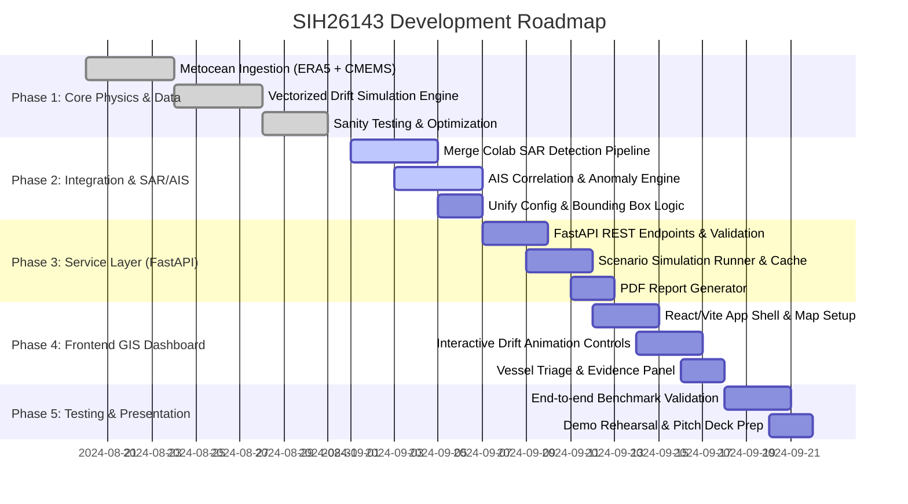

# Project Execution Phases & Sprint Roadmap

**Project:** SIH26143 — Satellite Oil Spill Detection, Drift Modeling & AIS Attribution  
**Status:** Phase 1 Complete (Drift Engine & Metocean Ingestion) | Phase 2 in progress  

---

## Roadmap Overview

---

## Phase Breakdown & Deliverables

### Phase 1: Metocean Data & Lagrangian Drift Engine *(COMPLETED)*
- [x] **ERA5 Wind Fetcher (`environmental_data.py`):** Automated CDS API retrieval, month-chunk splitting to prevent over-fetch bug.
- [x] **CMEMS Ocean Current Fetcher (`fetch_currents.py`):** Hourly SMOC surface current ingestion.
- [x] **Optimized Physics Engine (`drift_model.py`):** `VectorFieldLookup` NumPy array optimization ($0.18\text{s}$ execution time), Monte Carlo hindcast and forecast with boundary/beaching safety.
- [x] **Automated Tests (`test_drift_model.py`):** Physics bounds and invariant verification.

---

### Phase 2: SAR & AIS Pipeline Integration *(IN PROGRESS)*
- [ ] **Task 2.1 — SAR Detection Porting:**
  - Export teammate's Colab notebook into clean Python module under `app/sar/detector.py`.
  - Ensure output produces standard `SlickDetection` object.
- [ ] **Task 2.2 — AIS Scoring Engine (`app/ais/scoring.py`):**
  - Implement spatial filtering around `OriginWindow`.
  - Calculate `proximity_score`, `trajectory_score`, and `anomaly_score`.
  - Support synthetic AIS dataset generator for Mumbai / Gujarat coastal testing.
- [ ] **Task 2.3 — Unify Geographic Configurations:**
  - Reconcile `RegionOfInterest` in `app/config.py` with `compute_bbox` in `environmental_data.py`.

---

### Phase 3: Service Layer & API Backend
- [ ] **Task 3.1 — FastAPI REST API (`app/main.py`):**
  - `/api/v1/scenarios/run` — trigger end-to-end detection, drift, and AIS scoring.
  - `/api/v1/drift/hindcast` & `/api/v1/drift/forecast` — on-demand parameter testing.
  - `/api/v1/ais/candidates` — query vessels for a given origin window.
- [ ] **Task 3.2 — Intelligence Report Generator:**
  - Generate exportable PDF evidence summary with map snapshots, vessel rankings, and anomaly logs.

---

### Phase 4: Modern Web GIS Dashboard
- [ ] **Task 4.1 — Application Shell & Map Viewport:**
  - Vite + React + Leaflet/MapLibre GL.
  - Maritime dark mode theme (`#070b14`), glassmorphic overlays.
- [ ] **Task 4.2 — Dynamic Temporal Scrubber:**
  - Interactive slider from $T_{-48\text{h}} \rightarrow T_0 \rightarrow T_{+72\text{h}}$.
  - Animated particle scatter and AIS ship motion.
- [ ] **Task 4.3 — Candidate Vessel Inspector:**
  - Interactive card list ranked by probability with score decomposition meters.

---

### Phase 5: Validation, Benchmarking & SIH Pitch
- [ ] **Task 5.1 — Benchmark Scenario Testing:**
  - Test real historical oil spill event (e.g., Ennore / Mumbai port spill) and synthetic benchmark cases.
- [ ] **Task 5.2 — Pitch & Live Demo Readiness:**
  - Prepare pre-cached offline simulation fallback for robust live demonstration during judging.
